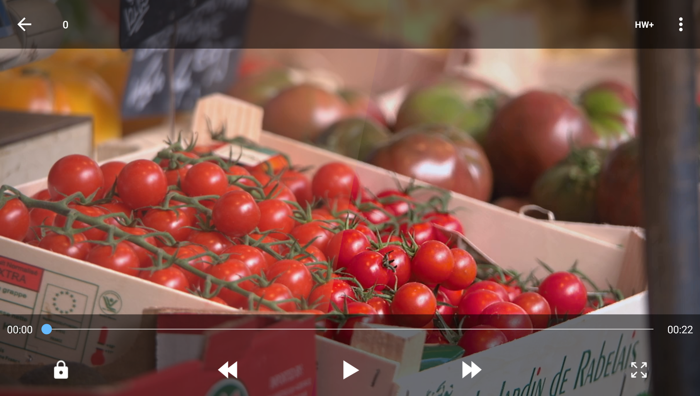

# VideoEnhancementPlus

a xposed module that let xperia mobile video enhancement feature(a.k.a X-Reality) work for every application

before/after

## usage

1. install edxposed and this module
2. active the module
3. if you are using whitelist mode in xposed, add `com.sonymobile.swiqisystemservice` to your whitelist

## about opensource

for convenience, im using a part code(`KotlinXposedHelper.kt` and `Log.kt`) from [BiliRoaming](https://github.com/yujincheng08/BiliRoaming), if you mind this plesse tell me, i will rewrite this part of code by myself
